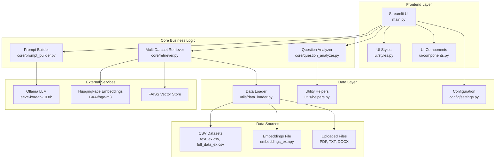
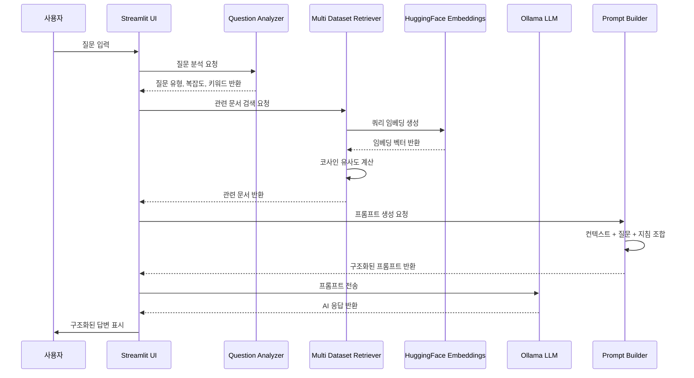
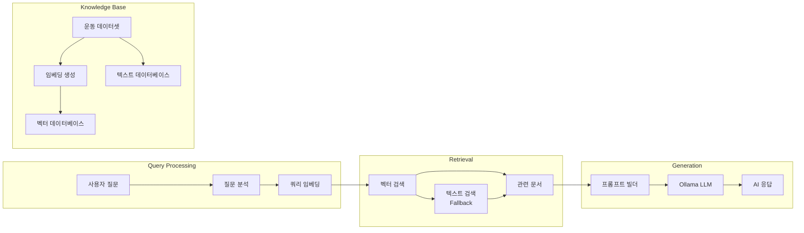

# AI 운동 프로그램 어시스턴트 - 시스템 아키텍처

## 🏗️ 전체 시스템 구조



## 📁 모듈별 상세 구조

### 1. Frontend Layer (UI)

```
app/
├── main.py                    # 메인 Streamlit 애플리케이션
├── ui/
│   ├── __init__.py
│   ├── styles.py             # CSS 스타일링
│   └── components.py         # 재사용 가능한 UI 컴포넌트
```

**주요 기능:**
- Streamlit 기반 웹 인터페이스
- 반응형 디자인과 커스텀 CSS
- 채팅 인터페이스와 사이드바 설정
- 빠른 질문 버튼과 파일 업로드

### 2. Core Business Logic

```
app/core/
├── __init__.py
├── prompt_builder.py         # 프롬프트 엔지니어링
├── retriever.py             # RAG 검색 엔진
└── question_analyzer.py     # 질문 분석 및 분류
```

**주요 기능:**
- **Prompt Builder**: 노리 AI 코치 역할의 구조화된 프롬프트 생성
- **Retriever**: 다중 데이터셋 기반 벡터/텍스트 검색
- **Question Analyzer**: 사용자 질문의 의도, 복잡도, 감정 분석

### 3. Data Layer

```
app/utils/
├── __init__.py
├── data_loader.py           # 데이터 로딩 및 검증
└── helpers.py              # 유틸리티 함수

app/config/
├── __init__.py
└── settings.py             # 애플리케이션 설정
```

**주요 기능:**
- **Data Loader**: CSV, 임베딩 파일 로딩 및 데이터 검증
- **Helpers**: 채팅 히스토리, 문서 포맷팅 등 유틸리티
- **Settings**: 모델 설정, 임계값, UI 설정 등

## 🔄 데이터 플로우



## 🧠 RAG (Retrieval-Augmented Generation) 아키텍처



## 🔧 기술 스택

### Frontend
- **Streamlit**: 웹 애플리케이션 프레임워크
- **CSS**: 커스텀 스타일링
- **Plotly**: 데이터 시각화

### Backend
- **Python 3.10**: 메인 프로그래밍 언어
- **LangChain**: LLM 애플리케이션 프레임워크
- **Ollama**: 로컬 LLM 서빙

### AI/ML
- **EEVE-Korean-10.8B**: 한국어 LLM 모델
- **BAAI/bge-m3**: 임베딩 모델
- **FAISS**: 벡터 유사도 검색
- **HuggingFace**: 모델 호스팅

### Data Processing
- **Pandas**: 데이터 조작
- **NumPy**: 수치 계산
- **Scikit-learn**: 코사인 유사도 계산

### File Processing
- **Unstructured**: 문서 파싱
- **LangChain Text Splitters**: 텍스트 청킹

## 🎯 주요 기능

### 1. 지능형 질문 분석
- 신체 부위 추출
- 운동 목표 식별
- 질문 복잡도 평가
- 감정 분석

### 2. 다중 데이터셋 검색
- 벡터 기반 의미 검색
- 텍스트 기반 키워드 검색 (Fallback)
- 유사도 점수 기반 랭킹

### 3. 구조화된 응답 생성
- 노리 AI 코치 역할
- 운동 루틴 테이블 형식
- 단계별 운동 설명
- 안전 가이드라인

### 4. 사용자 경험
- 실시간 채팅 인터페이스
- 빠른 질문 버튼
- 파일 업로드 지원
- 시스템 통계 대시보드

## 🔒 보안 및 성능

### 보안
- 로컬 LLM 사용으로 데이터 프라이버시 보장
- 파일 업로드 검증
- 입력 데이터 sanitization

### 성능
- 캐싱을 통한 응답 속도 최적화
- 임베딩 모델 CPU 최적화
- 점진적 데이터 로딩

## 🚀 배포 옵션

### 로컬 실행
```bash
cd Langserve-ollama
source ../venv/bin/activate
streamlit run app/main.py
```

### 클라우드 배포
- **Streamlit Cloud**: 무료 호스팅
- **Vercel**: 정적 사이트 호스팅
- **ngrok**: 로컬 터널링

이 아키텍처는 모듈화된 설계로 유지보수성과 확장성을 고려하여 구축되었습니다. 